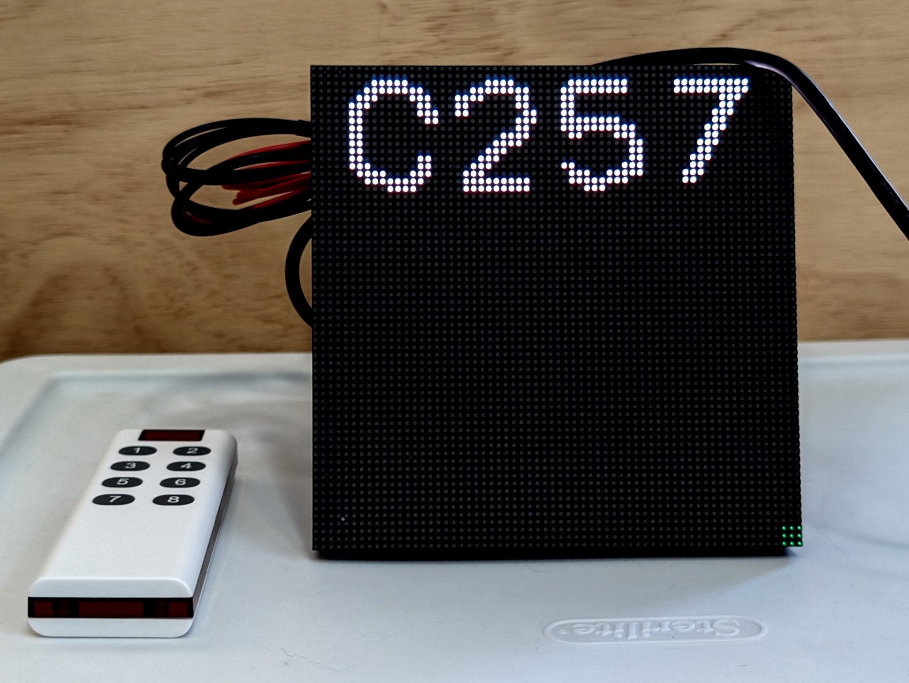
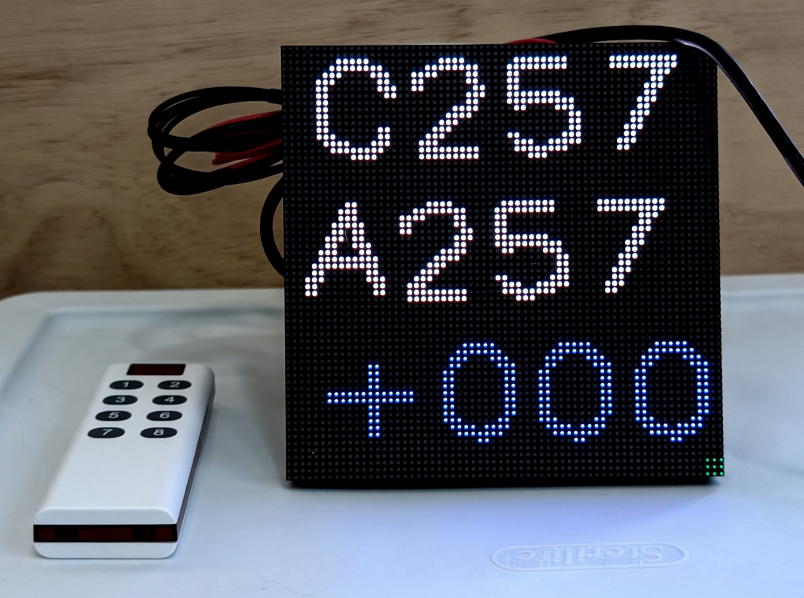

## I75W LED Matrix Display for Raymarine Tilllerpilot

> [!NOTE]
> **These are bad photos and will be replaced soon! They don't show the actual display brightness!**

### Intent
This project is for DIY sailors who have skills and interest in electronics projects. For those not inclined, there are commerically available (and more expensive) displays available. I'm not selling anything: the hardware is readily available from 3rd parties and the code here is free to use at your own risk.

### Tillerpilot
This project assumes you are using a Raymarine Tillerpilot, such as a ST1000+ or ST2000+. These devices are somewhat antiquated, but are widely used and relatively low-cost solution for automated steering. They have well-known flaws, such as lack of waterproofing, hard end stops and the use of an outdated communications protocol. Other DIY options are available, such as pyPilot or mechanical windvanes which are not covered here.

### General Description
* This project uses off-the-shelf hardware to create an remote daylight-visible display for Raymarine Tillerpilots. A Tillerpilot is typically mounted near the stern of a boat, and it's incovenient to view the display. This display can be mounted in an better location. 
* You can use the I75W display by itself, but it only solves half the problem. It's also inconvenient to operate the Tillerpilot from the stern. A Nauti-Control ST control module, with a handheld wireless keypad, is the essential component for a complete solution.
* The I75W Display allows sailors to get immediate visual feedback from their Tillerpilot when controlling it using the ST wireless module. NautiControl has a mobile phone UI, but I can't manage that singlehanded in typical sailing conditions.

### What the Display Shows
The display emulates what is shown on the Tillerpilot screen, and only supports the two primary modes: Standby and Auto. 

__Standby Mode:__
* The top line show "C" (for compass) and the magnetic compass heading. Raymarine calls this "the boat’s current compass heading." Signal K calls this navigation.headingMagnetic. The value is dependent on Tillerpilot calibration and will probably differ from magnetic heading sent from other instruments.
* No other lines are shown.

__Auto Mode:__
* The top line is the same as in Standby Mode:  C (for compass) and the magnetic compass heading.
* The middle line shows "A" (for Auto) and the target heading. Raymarine calls this the "locked autopilot heading." Signal K calls this steering.autopilot.target.headingMagnetic.
* The bottom line shows the difference between the two...this is a little redundant.

__Status Indicators:__
* There is a blinking white status indicator in the center, that just indicates that the I75 firmware is running.
* The lower right corner status light is steady green if it's receiving data from the Signal K server, and flashes oragnge if it is not.
* The lower left corner status light is steady green if it the magentic heading is updating, and flashes oragnge if it is not.

### Hardware
The hardware is off-the-shelf: a Pimoroni I75W board driving a separate LED Matrix Display. The I75 board connects to The display with a ribbon cable. The display used here is a 64x64 2mm pitch LED Matrix (128x128mm). The 2mm pitch offers higher LED density and a compact package. Other display sizes are available, but this software is only supports 64x64.

### LED Matrix Display Info
The LED matrix is used because it's bright, inexpensive, readily availble and updates quickly (unlike eink). The system is capable of fancy graphics, see the splash screen or Pimoroni for examples. 
These displays have a Hub 75 interface for connection to a microcontroller or small computer like a Raspberry Pi.
Matrix displays come in various LED dimentions, such as 32x32, 64x32, 128x64 etc. The physical dimensions are dependent on the LED pitch, for example 3, 2.5 and 2mm. Finer pitch gives better light density and smaller display size.

The ones I'm using are 64x64 with 2mm pitch, which are 128x128mm in physical size. I also have some 128x64 2mm pitch panels but they are large for my boat. Panels can be chained to create a larger display, with the upper limit depending on the controller board.

### Microcontroller Board
* The LED matrix display panel need a separate controller. This project uses a Pimoroni board https://shop.pimoroni.com/products/interstate-75-w?variant=54977948713339. It's reliable and fast, and Pimoroni's custom micropython build includes the matrix drivers. The board has wifi and Bluetooth connectivity. 
* There are other boards available that include the Hub 75 interface from Adafruit and other vendors, for the Raspberry Pi and ESP-32. 

### Power Requirement
The hardware runs on 5v and will need a voltage coverter for a 12 or 24v system. It can be powered from a USB-C cable or a simple 5v power cable.
LED matrix displays can use a lot of power, dependent on the display size and how many LEDs are turned on. For a text-only display the power consumption is reasonable.

### Signal K Server Requirement
This project requires a Signal K server, typically running on a Raspbery Pi 4B or 5, and used by many DIY sailors. The Tillerpilot sends data using the Seatalk1 protocol to the Signal K server. If you want remote controler. The I75W board and display connects wirelessly to the Signal K server to retrieve the Tillerpilot data.

There are several options for sending data from the Tillerpilot to the Signal K server:
1) Use an optoisolater to hard-wire the Tillerpilot to a Raspbery Pi port - this is simple and is described in the Signal K documentation for Seatalk.
2) Use a MacArthur Hat, which has a Seatalk1 port, also hard-wired to the Tillpilot. This Hat is widely used by DIY sailors and also handles NMEA2000 connections.

There may be future options to send Tillerpilot data from a NautiControl ST Wireless module directly to a I75W display, without the need for a Signal K server.

### Troubleshooting Signal K Connections
If you having seeing any unexpected results, you can run the debug python script "debug_signalk.py" and it will report on the Signalk K responses. This script outputs to the console of a Python IDE such as Thonny. There is no output to the LED matrix. Sample results are included in the program comments. 

### Software Description (optional read)
The code is written in Micropython with the help of Claude.ai. The code runs on single RP2350 core, and profiling shows there is plenty of headroom.
The connection uses the Signal K websockets interface for lowest latency communications.
Retry logic is used for the wireless LAN connection and for the websocket connection to the Signal K server.
The wireless configuration supports both DHCP and a static IP address.
Common configuration items are stored in a secrets.py file, so the main code file doesn't need to be edited, unless the display size or other significant changes are made.
There are optional flags available to print performance data to a console.
There is a splash screen to demo the graphics capabilities of the board, but the working display is simple text that emulates the Tillerpilot display.
Enabling debugging will write error messages to a file.

### Software Installation on the I75W Board
 * On you Raspberry Pi Signal K server, run the script signalk plugin.txt to create a heartbeat plugin, which is used to detect that the server connection is alive. The plugin must be enabled.

1) Follow the Pimoroni instructions on how to install the latest version of their custom Micropython distribution onto the I75W board.
2) There are a few options for loading Micropython code files onto the board, the simplest to use the Thonny programming tool - it's a free download. VS Code can be used but it's more complicated to set up. It's not possible to just drop the files onto the device mounted as a USB drive.
3) Run Thonny, connect the I75W board with a USB cable. Under options, set the Interpreter to MicroPython (Raspberry Pi Pico) and set the Port to the USB serial port the board is using.
4) When this is done correctly, the board file system shows up on the left hand side of the display as Raspberry Pi Pico. If you're having problems there tutorials for using Thonny with these boards.
3) Follow these instructions to add a websocket library: https://pypi.org/project/micropython-async-websocket-client/
5) Drop in the secrets file, modified for the wireless network, and the program file into the root.

### Waterproofing
The display is not waterproof and requires a case. Later, I'll add documentation for a case build using a low-reflective acrylic front panel. It's possible to buy waterproof matrix displays, but they are expensive - intended for use in outdoor venues such as sports stadiums.

### Links:

https://shop.pimoroni.com/products/interstate-75-w?variant=54977948713339

https://nauti-control.com/

