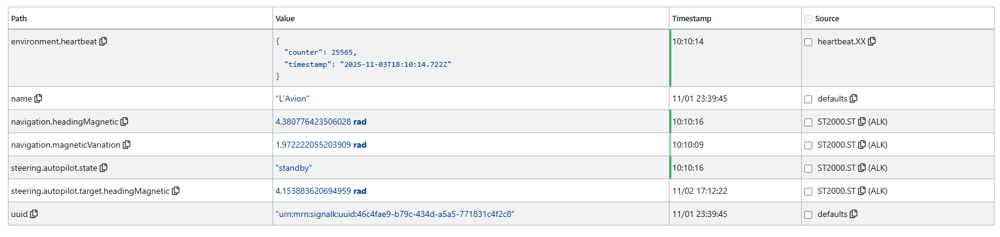

## I75W LED Matrix Display for the Raymarine Tilllerpilot

> [!NOTE]
> **These are bad photos and will be replaced soon! They don't show the actual display brightness!**

### Intent
This project is for DIY sailors who have skills and interest in electronics projects. For those not inclined, there are commerically available (and more expensive) displays available. I'm not selling anything: the hardware is readily available from 3rd parties and the code here is free to use at your own risk.

### Tillerpilot
This project assumes you are using a [Raymarine Tillerpilot](https://www.raymarine.com/en-us/our-products/boat-autopilots/autopilot-packs/st1000-st2000), such as a ST1000+ or ST2000+. These devices are somewhat antiquated, but are widely used and relatively low-cost solution for automated steering. They have well-known flaws, such as lack of waterproofing, hard end stops and the use of an outdated communications protocol. Other DIY options are available, such as pyPilot, which are not covered here.

### General Description
* This project uses off-the-shelf hardware to create an remote daylight-visible display for Raymarine Tillerpilots. A Tillerpilot is typically mounted near the stern of a boat, and it's incovenient to view the display. This display can be mounted in an better location. 
* You can use this project by itself, but it only solves half the problem. It's also inconvenient to operate the Tillerpilot from the stern. A [Nauti-Control ST control](https://nauti-control.com/) module, with a handheld wireless keypad, is the essential component for a complete solution.
* The I75W Display allows sailors to get immediate visual feedback from their Tillerpilot when controlling it using the ST wireless module. NautiControl has a mobile phone UI, but I can't manage that singlehanded in typical sailing conditions.

### What the Display Shows
The display emulates what is shown on the Tillerpilot screen, and only supports the two primary modes: Standby and Auto.

__Standby Mode:__
* The top line show "C" (for compass) and the magnetic compass heading. Raymarine calls this "the boat’s current compass heading." Signal K calls this navigation.headingMagnetic. The value is dependent on Tillerpilot calibration and will probably differ from magnetic heading sent from other instruments.
* No other lines are shown.

__Auto Mode:__
* The top line is the same as in Standby Mode:  C (for compass) and the magnetic compass heading.
* The middle line shows "A" (for Auto) and the target heading. Raymarine calls this the "locked autopilot heading." Signal K calls this steering.autopilot.target.headingMagnetic.
* A third line is reservered for future changes.

__Status Indicators:__
* The lower left corner status light is steady green if it's receiving data from the Signal K server, and flashes orange if it is not.
* The lower right corner status light is steady green if the magentic heading is updating, and flashes orange if it is not. You may see it flash if the boat is stationary.
* There is a blinking white status indicator in the center that indicates that the firmware is running.

### Hardware Overview
The hardware is off-the-shelf and requires a Pimoroni I75W microcontroller board, a separate LED Matrix Display and a couple cables. Maxtrix displays are commonly used for outdoor signage. The system is capable of fancy graphics - Pimoroni has examples. This project emulates the Tillerpilot and mostly uses text.

### Controller Board
* This project uses a [Pimoroni board](https://shop.pimoroni.com/products/interstate-75-w?variant=54977948713339) with a Hub 75 hardware interface for the LED matrix display. It's reliable, fast and includes a custom micropython build with the matrix drivers, wifi and Bluetooth.
* Other boards are available that include a Hub 75 interface, from Adafruit and other vendors for the Raspberry Pi and ESP-32. This code only runs on the Pimoroni board.

### LED Matrix Display
The LED matrix displays are bright, inexpensive, readily availble and update quickly (unlike eink). Matrix displays come in various LED dimentions, such as 32x32, 64x32, 128x64 etc. The physical dimensions are dependent on the LED pitch, for example 3, 2.5 and 2mm. They interface with a controller via a Hub 75 hardware interface. Panels can be chained to create a larger display, limited by controller board and power consumption. 

I'm using 64x64 matrix displays with 2mm pitch, which are 128x128mm in physical size. The finer 2mm pitch offers higher LED density and a compact package. Other display sizes are available, but this software is only supports 64x64 panels. The larger 128x64 2mm pitch panels are large for my boat.

### Power Requirement
The hardware runs on 5v and will need a voltage coverter for a 12v system. It can be powered from a USB-C cable or a simple 5v power cable.
LED matrix displays can use a lot of power, dependent on the display size and how many LEDs are turned on. For a text-only display the power consumption is reasonable.

### Signal K Server Requirement
This project requires a Signal K server, typically running on a Raspbery Pi 4B or 5, and used by many DIY sailors. The Tillerpilot sends data using the Seatalk1 protocol to the Signal K server. The I75W board and display connects wirelessly to the Signal K server to retrieve the Tillerpilot data.

There are a couple options for receiving Tillerpilot data on the Raspberry / Signal K server.
* Use an optoisolater to hard-wire the Tillerpilot to a Raspbery Pi port - this is simple and is described in the [Signal K documentation for Seatalk](https://demo.signalk.org/documentation/Configuration/Seatalk_Connections.html).
* Use a [MacArthur Hat](https://openmarine.net/macarthur-hat), which has a Seatalk1 port, also hard-wired to the Tillpilot. This Hat is widely used by DIY sailors and also handles NMEA2000 connections.

There may be future options to send Tillerpilot data from a NautiControl ST Wireless module directly to a I75W display, without the need for a Signal K server.

### Raspberry Pi and Signal K
Signal K runs well on a Raspberry Pi 4B or 5, dependent on how many other devices are connected and sending data, such as running a NEMA 2000 backbone. 
The hardware in this project can connect directly to the wifi module on the Pi in Access Point mode. Auto power should be disabled and other tweaks may be necessary. 
An alternative solution is to use a wifi travel router connected to the Pi with an ethernet cable. Of course this is more equipment to maintain. 

### Signal K Software Installation
This installation assumes you already have Signal K running on a Raspberry Pi. If not, the [Signal K website has good instructions](https://demo.signalk.org/documentation/Installation/Raspberry_Pi.html).
 * On your Raspberry Pi Signal K server, run the script heartbeat.sh - this creates plugin that the display board uses to determine if the server connection is alive.
 * The plugin must be enabled in Server > Plugin Configuration > Heatbeat
   
With a Tillerpilot connected correctly, you should see the following paths in the Signal K Data Browser. In the image below, the configured data source ID is ST2000.
* environment.heartbeat (this is from the heatbeat script)
* navigation.headingMagnetic (from ST1000+)
* navigation.magneticVariation (from ST1000+)
* steering.autopilot.state (from ST1000+)
* steering.autopilot.target.headingMagnetic (from ST1000+ after the Tillerpilot's been put in Auto Mode)

### Software Installation on the I75W Board
1) Follow the Pimoroni instructions on how to install the latest version of their custom Micropython distribution onto the I75W board.
2) There are a few options for loading Micropython code files onto the board, the simplest to use the Thonny programming tool - it's a free download. VS Code can be used but it's more complicated to set up. It's not possible to just drop the files onto the device mounted as a USB drive.
3) Run Thonny, connect the I75W board with a USB cable. Under options, set the Interpreter to MicroPython (Raspberry Pi Pico) and set the Port to the USB serial port the board is using.
4) When this is done correctly, the board file system shows up on the left hand side of the display as Raspberry Pi Pico. If you're having problems there tutorials for using Thonny with these boards.
5) Drop in the secrets file, modified for the wireless network, and the program file into the root. At a minimum you'll need to configure the wifi connection in secrets.

### Software Description (optional read)
The code is written in Micropython with the help of Claude.ai. The code runs on single RP2350 core, and profiling shows there is plenty of headroom.
The connection uses the Signal K websockets interface for lowest latency communications.
Retry logic is used for the wireless LAN connection and for the websocket connection to the Signal K server.
The wireless configuration supports both DHCP and a static IP address.
Common configuration items are stored in a secrets.py file, so the main code file doesn't need to be edited, unless the display size or other significant changes are made.
There are optional flags available to print debug data to a console.

### Protection and Waterproofing
The LEDs on the panel are exposed and can be damaged with careless handling.

The display is not waterproof and requires a case. Later, I'll add documentation for a case build using a low-reflective acrylic front panel. It's possible to buy waterproof matrix displays, but they are expensive - intended for use in outdoor venues such as sports stadiums.

